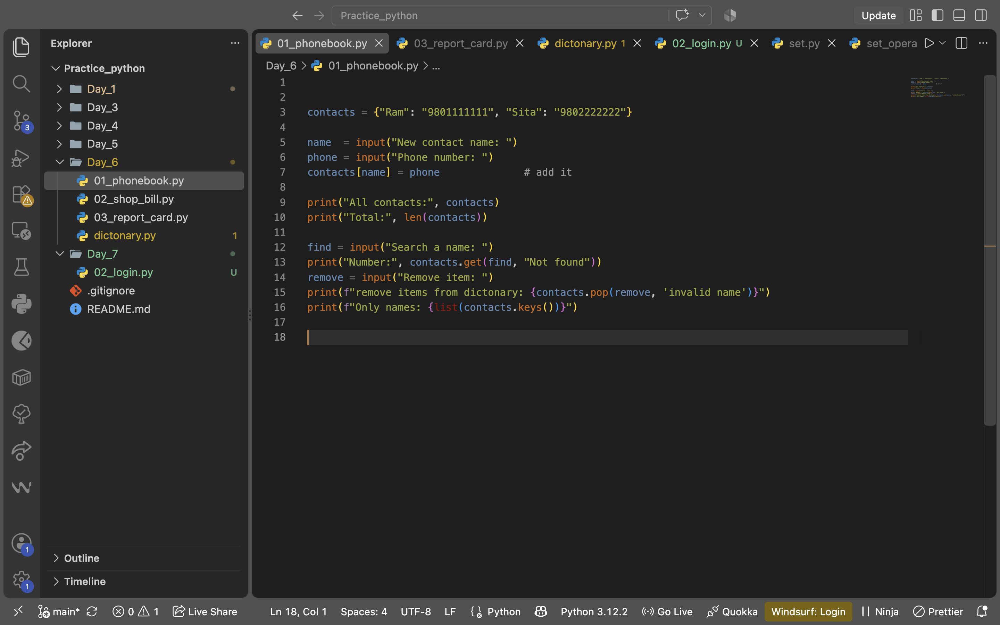
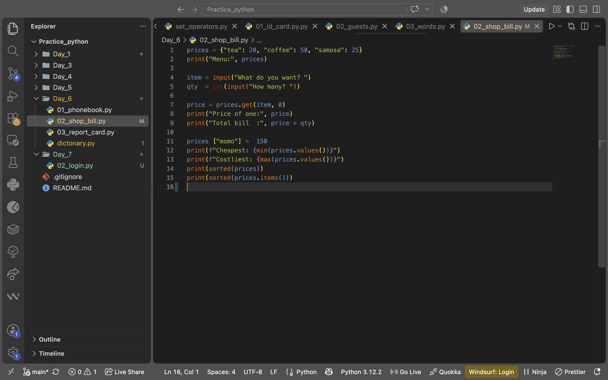
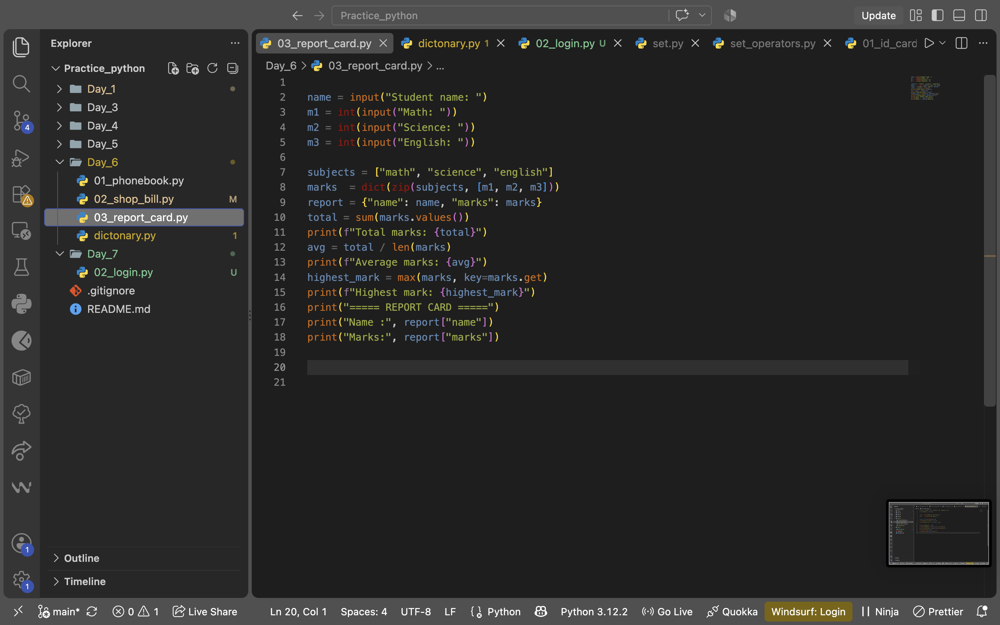

# DS_ML_Course

My daily notes, exercises, projects, and code from my **Data Science & Machine Learning course at Skills Shikshya**.

This repository documents my **100 Days of Data Science & Machine Learning journey**, starting from Python fundamentals and gradually progressing toward Data Science and Machine Learning.

## 📚 Learning Journey

| Day   | Topic                  | Practice / Projects                                                       |
| ----- | ---------------------- | ------------------------------------------------------------------------- |
| Day 1 | Python Basics          | Python fundamentals and practice                                          |
| Day 2 | Git & GitHub           | Version control, repositories, branches, merging, conflicts, `.gitignore` |
| Day 3 | Python Fundamentals    | Menu Calculator, Shopping Receipt, Profile Card Generator                 |
| Day 4 | Python Lists           | To-Do List, Shopping Cart, Seating Chart                                  |
| Day 5 | Tuples & Sets          | Student ID Card, Party Guest List, Common Words Finder                    |
| Day 6 | Python Dictionaries    | Phonebook, Tea Shop Bill, Report Card                                     |
| Day 7 | Conditional Statements | `if`, `elif`, `else` and conditional practice                             |

> Day 2 does not have a separate folder because the session focused on learning and practicing Git & GitHub.

## 🛠️ Technologies & Tools

* Python
* Git
* GitHub
* VS Code
* Data Science & Machine Learning tools *(as covered throughout the course)*

## 📂 Repository Structure

```text
DS_ML_Course/
│
├── Day_1/
├── Day_3/
├── Day_4/
├── Day_5/
├── Day_6/
│   └── screenshot/
├── Day_7/
│
├── .gitignore
└── README.md
```

## 📸 Day 6 Projects

### 📱 Phonebook

A simple Python phonebook project using dictionaries to store and manage contact information.



### 🍵 Tea Shop Bill

A simple Python billing project using dictionaries and calculations to manage items, quantities, prices, and the total bill.



### 📊 Report Card

A simple Python report card project using dictionaries to store student information, subjects, marks, and calculate results.



## 🎯 Goal

To build a strong foundation in **Python, Data Science, and Machine Learning** through consistent daily learning and practical projects.

## 📈 Progress

**Days Completed: 7 / 100**

🚀 Learning every day. Building every day.
